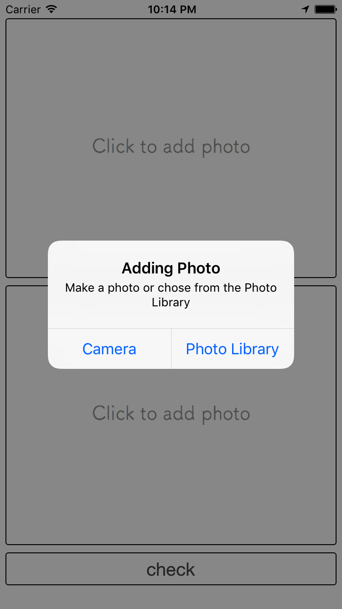
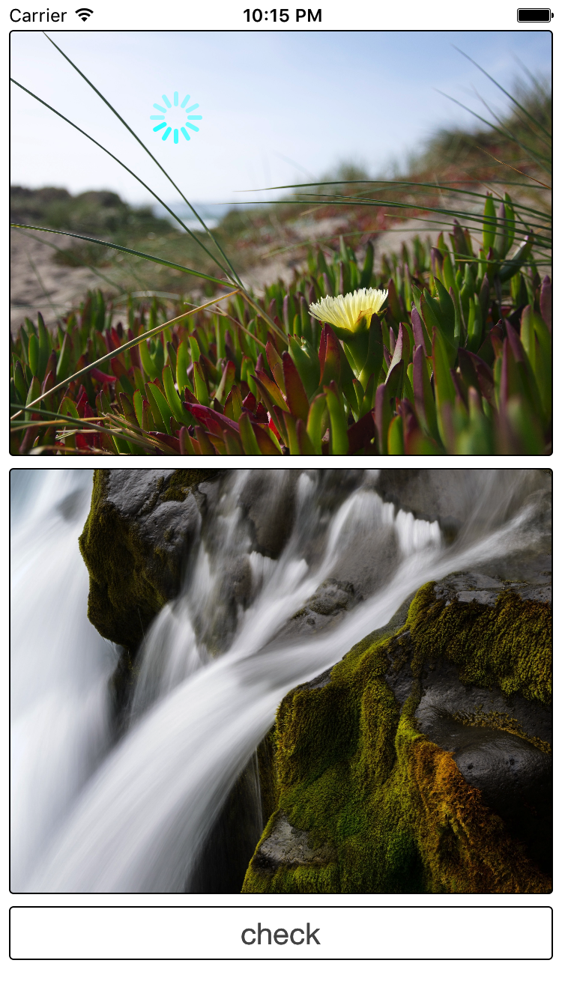

# HowDoWeMatch
My first app checking if two photos match together.

A user can add photos from Photo Library or make a photo using camera. 
After pushing check button the app is checking how much the photos are matching to each other.

  
  
  
  

